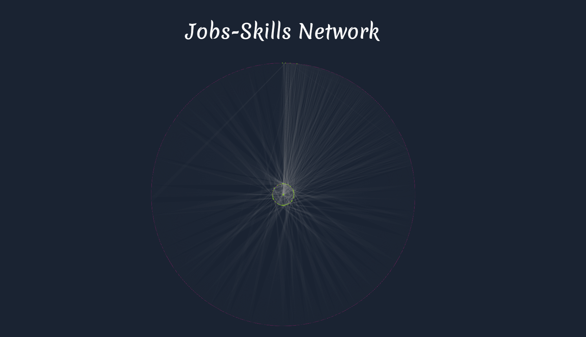

# Career Navigator
Career Navigator is a user-friendly application designed to empower individuals in their career exploration. It acts as a comprehensive guide, leveraging data analysis and visualization techniques to provide valuable insights into the job market.

## Installation

### Install the required packages
```bash
pip install -r requirements.txt
```

### Setup the environment variables
```bash
cp .env.example .env
```
Then, set your environment variables in the `.env` file. like `MAPBOX_ACCESS_TOKEN` and `LOCATIONIQ_API_KEY` values.

### Install Datasets
Download the required datasets from this [direct link](https://www.kaggle.com/datasets/asaniczka/1-3m-linkedin-jobs-and-skills-2024/download?datasetVersionNumber=2)

After downloading the zip file, exctract `job_skills.csv` and `linkedin_job_postings.csv` files and put them in `src/data`directory.


# App Features
## Intuitive Interface

A user-friendly Graphical User Interface (GUI) simplifies interaction and navigation, making it easy to search for relevant jobs.

## Skill-Based Recommendations 

By identifying your skillset, the application recommends jobs that align with your expertise.

## Network Visualization

Gain a comprehensive picture of the job market through a network graph that showcases the connections between job titles and required skills.

## Highly Demanded Skills Analysis
 
Leveraging Betweenness Centrality Analysis, the app presents a clear bar graph highlighting the most sought-after skills in the current market, helping you tailor your skillset accordingly.

## Actionable Insights 

The application goes beyond just identifying in-demand skills. It provides actionable insights that suggest the next skill to learn and recommends relevant courses from platforms like Coursera.

## Interactive Job Distribution Heatmap

Explore job opportunities across the globe with an interactive map, allowing you to identify areas with higher concentrations of your desired positions.

## 3D Posting Frequency Visualization 

Gain a unique perspective on job postings with a 3D visualization that depicts posting frequency across different cities.

